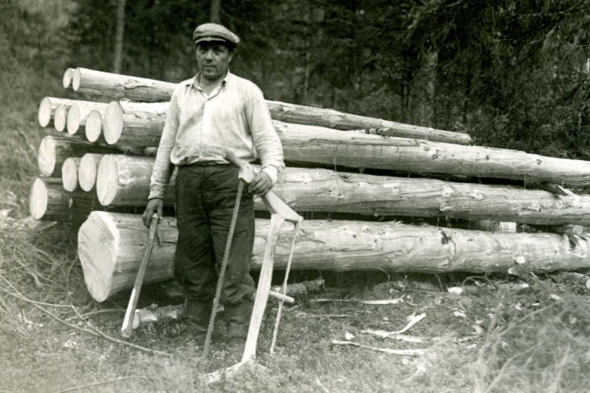

## Hallo

VVV
Hallo leute,

Ich heiße Gill, und es wird euch velleischt überraschen um tu hören, dass ich bin hier gewesen seit dem ersten tag! Meistens..

---
<!--.slide: data-background-image="./Pictures/cantankerous.png" class="text-bg-bw"-->
### Streitsüchtiger alter Mann

cantankerous old man

VVV

Aber, weil ich ein streitsüchtiger alter Mann geboren wurde, ich meist sitze hinten und brummle oder nicke ein.
Denn, wie ich habe schon gesagt, ich bin alt, und es ist spät..

Aber, obwhol ich bin mürrisch Alter, ich habe ein dämlich Interesse an Komödie.So ich will euch ein bisschen erzählen ein wenig über deutsch-englische Komödie-Verbindung 

---
<!--.slide: data-background-image="./Pictures/sleeping.png" class="text-bg-clr"-->

<b>brummle</b> - grumble  
<b>einnicken</b> - doze off  
dämlich - geeky  
Verbindung - connections

VVV

Aber, weil ich ein streitsüchtiger alter Mann geboren wurde, ich meist sitze hinten und brummle oder nicke ein.
Denn, wie ich habe schon gesagt, ich bin alt, und es ist spät..

Aber, obwhol ich bin mürrisch Alter, ich habe ein dämlich Interesse an Komödie.So ich will euch ein bisschen erzählen ein wenig über deutsch-englische Komödie-Verbindung 

---
<!--.slide: data-background-image="./Pictures/eskimo.png" class="text-bg-clr"-->

Schlager

VVV

Die Deutschen sind nicht für den Humor bekannt. Aber meisten der Idee der ernsten Deutschen kommt aus Groß Britannien, und wir nahmen es, ein bisschen, solange wir wissen dass Filme wie Eskimo Limon waren eine Deutschen-Schlager! 
---
<!--.slide: data-background-image="./Pictures/eskimo.png" class="text-bg-clr"-->

## Flachwitze 
<blockquote>
Zwei Männer gehen über eine Brücke. Der eine fällt ins Wasser, der andere heißt Helmut.
</blockquote>

VVV

Ja, die Deutschen Flachwitze sind berühmt, beispielsweise - 
"Zwei Männer gehen über eine Brücke. Der eine fällt ins Wasser, der andere heißt Helmut."
Aber jeden land hat sie! 

("Two men walk over a bridge. One falls into the water, the other is called Helmut.").
---

VVV

Englisch-Humor ist berühmt. 
Aber, weiß jemand was ist die meisten wiederholt TV-Program in Deutschland?

---
<!--.slide: data-background-image="./Pictures/dinner.png" class="text-bg-bw"-->

VVV

Seit 1963, jeder Silvester, eine Show namens Der 90. Geburtstag, oder Dinner for One. Es handelt sich um einen etwa 18-minütigen Sketch des englischen Komikers Freddie Frinton mit seinem Partnerin May Warden. 

---
<!--.slide: data-background-image="./Pictures/dinner2.png" class="text-bg-bw"-->

VVV

Es erzählt von Fräulein Sophie und ihre 90. Geburtstags feier. Wegen ihres langen Lebens sind die einzigen Gäste sie und ihr Butler, James. 
James will nicht seinen Meister traurig, und so er vorgibt zu sein ihre toten Freunde. Gehen rund um den Tisch, er trinkt Glas nach Glas, bis er ist komplett betrunken! 

Jeder Silvester! Seit 1963! fantastisch..!

---
<!--.slide: data-background-image="./Pictures/zirkus.png" class="text-bg-clr"-->
### und jetzt   etwas ganz anderes
---
<!--.slide: data-background-image="./Pictures/dieGruppe.png" class="text-bg-bw"-->
Monty Python's Fliegender Zirkus

VVV
In 1972 wurde die englische Gruppe vom bayerischen Fernsehen eingeladen, eine deutsche Version ihrer Show aufzunehmen. 
Die Pythons lernten hierfür den deutschen Text phonetisch auswendig, abgesehen von John Cleese - der ein bisschen deutsch spricht.

---
<!--.slide: data-background-image="./Pictures/zirkus2.png" class="text-bg-clr"-->

---
<!--.slide: data-background-image="./Pictures/zirkus2.png" class="text-bg-clr"-->

Die Handlung - The plot
 
Unsinn - nonsense 

---
<!--.slide: data-background-image="./Pictures/zirkus2.png" class="text-bg-clr"-->

---
<!--.slide: data-background-image="./Pictures/zirkus2.png" class="text-bg-clr"-->

---
<!--.slide: data-background-image="./Pictures/zirkus2.png" class="text-bg-clr"-->

---
<!--.slide: data-background-image="./Pictures/zirkus2.png" class="text-bg-clr"-->

---
<!--.slide: data-background-image="./Pictures/zirkus2.png" class="text-bg-clr"-->

---
<!--.slide: data-background-image="./Pictures/zirkus.png" class="text-bg-clr"-->

## Das Holzfäller-Lied

---
<!--.slide: data-background-image="./Pictures/zirkus.png" class="text-bg-clr"-->
## Das Holzfäller-Lied

<iframe width="560" height="315" src="https://www.youtube.com/embed/aiVOG199X2c" frameborder="0" allowfullscreen></iframe>

---
<!--.slide: data-background-image="./Pictures/zirkus.png" class="text-bg-clr"-->

Ich bin ein Holzfäller und fühl mich stark
  Ich schlaf des Nachts und hack am Tag 
  
  Er ist ein Holzfäller und fühlt sich stark
  Er schlaft des Nachts und hackt am Tag 
  
  Ich fälle Bäume, ich ess mein Brot, 
  ich geh auf das WC
  Am Mittwoch geh ich shopping,
  kau Kekse zum kaffee 
  
  Ich fälle Bäume und hupf und spring,
  steck Blumen in die Vas
  Ich schlupf in Frauenleider,
  und lümmel mich in Bars 
  
  Er ist ein Holzfäller und fühlt sich stark
  Er schlaft des Nachts und hackt am Tag
  
  Ich fälle Bäume,
  trag Stöckelschuh und Strumpf und Büstenhalter
  Wär gern ein kleines Mädchen,
  so wie mein Onkel Walter 

---
## Helge Schneider

--

--

--
