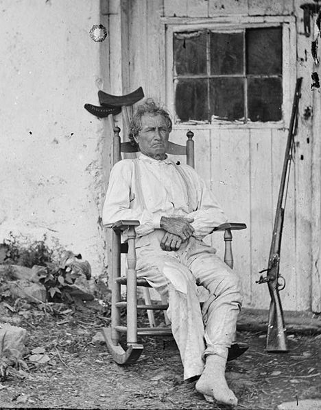

## Anglo-German Humor 

rancorous
cantankerous

--
streitsüchtiger alter Mann 

Weltschmerz
--

--

VVV

Hello all,
my name is Gill. You might not know me, because 
It's just that I've been sitting at 
--

Flachwitze

Schnodderdeutsch

Der 90. Geburtstag - Dinner for One - 1963 with Freddie Frinton and May Warden

VVV

Der 90. Geburtstag oder Dinner for One ist eine Fernsehproduktion des NDR aus dem Jahr 1963. Es handelt sich um einen etwa 18-minütigen Sketch des englischen Komikers Freddie Frinton mit seiner Partnerin May Warden.

In Deutschland ist der Sketch inzwischen fester Bestandteil des Silvester-Fernsehprogramms aller dritten Programme der ARD. Die Sendung ist die am häufigsten wiederholte des deutschen Fernsehens und wurde 1988 im Guinness-Buch der Rekorde als „weltweit am häufigsten wiederholte Fernsehproduktion“ aufgeführt. 2003 wurde der Sketch in Deutschland 19-mal ausgestrahlt, seit 1963 bis Ende 2003 insgesamt 231-mal.[3] Die Sendung hat Kultstatus und ist in vielen Haushalten fester Bestandteil des Tagesablaufs zu Silvester. So sahen beispielsweise im Rekordjahr 2004 insgesamt 15,6 Millionen Deutsche den Sketch.[4] 
---
"Zwei Männer gehen über eine Brücke. Der eine fällt ins Wasser, der andere heißt Helmut." ("Two men walk over a bridge. One falls into the water, the other is called Helmut.").
---
und jetzt etwas ganz anderes
--
Monty Python's Fliegender Zirkus

--

--

--

---

--

--

---

--

--

--

---
## Das Holzfäller-Lied

vvv
1972 wurde dieser Sketch von einem unbekannten Übersetzer ins Deutsche übertragen und für die erste Folge von Monty Pythons fliegender Zirkus aufgenommen. Die Pythons lernten hierfür den deutschen Text phonetisch auswendig. Auch sang in dieser Version kein Mountie-Chor den Refrain („Er ist ein Holzfäller und fühlt sich stark, er schläft des Nachts und hackt am Tag“), sondern ein Trupp deutscher Grenzpolizisten.

In 1972, this sketch was translated into German by an unknown translator and recorded for the first episode of Monty Python's flying circus. The pythons learned the German text phonetically by heart. Also, in this version, no chorus chorus ("He is a lumberjack and feels strong, he sleeps at night and chops in the day"), but a troop of German border policemen.
<!--.slide: data-background-video="" data-background-video-loop="true" data-background-video-muted="true"-->

<iframe width="560" height="315" src="https://www.youtube.com/embed/aiVOG199X2c" frameborder="0" allowfullscreen></iframe>

--

Ich bin ein Holzfäller und fühl mich stark
  Ich schlaf des Nachts und hack am Tag 
  
  Er ist ein Holzfäller und fühlt sich stark
  Er schlaft des Nachts und hackt am Tag 
  
  Ich fälle Bäume, ich ess mein Brot, 
  ich geh auf das WC
  Am Mittwoch geh ich shopping,
  kau Kekse zum kaffee 
  
  Ich fälle Bäume und hupf und spring,
  steck Blumen in die Vas
  Ich schlupf in Frauenleider,
  und lümmel mich in Bars 
  
  Er ist ein Holzfäller und fühlt sich stark
  Er schlaft des Nachts und hackt am Tag
  
  Ich fälle Bäume,
  trag Stöckelschuh und Strumpf und Büstenhalter
  Wär gern ein kleines Mädchen,
  so wie mein Onkel Walter 

---
## Helge Schneider

--

--

--
